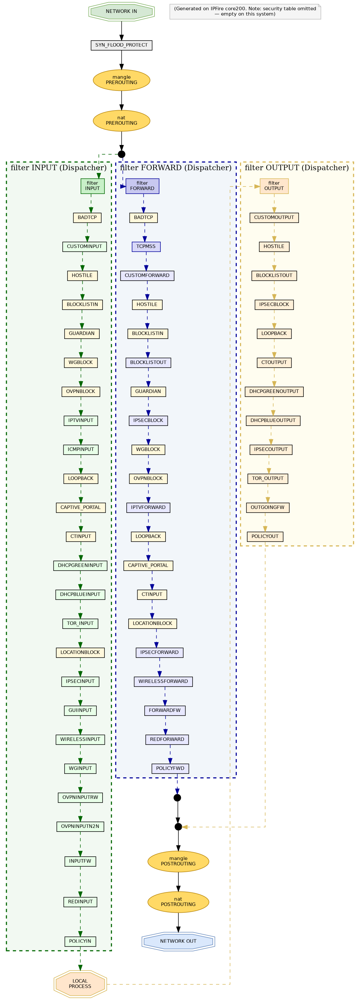

---

# diagraph-ipfire

A minimalist, high-performance Bash utility designed to parse, map, and visualize active `iptables` (Netfilter) rule structures and execution flows native to IPFire routing environments.

**Architects:** H&M  
**Developers:** H&M and Gemini (v1.0.0) | H&M and Claude Sonnet 4.6 (v1.0.1+)

## Visualization preview

The default output is a PCB-style top-to-bottom chain map. Every Netfilter stage is visible — dispatch wrappers, serial chain execution order, and packet traversal paths overlaid as orange arrows.



> Rendered with `dot -Tpng -Gdpi=120 -Grankdir=TB`. See [doc/USAGE.md](doc/USAGE.md) for full rendering instructions.

## Features

* **Global Unified Map**: Interrogates all primary Netfilter tables (`raw`, `mangle`, `nat`, `filter`, `security`) simultaneously, grouping root chains and sub-chains into clean visual clusters.
* **Packet Traversal Skeleton**: The three Netfilter packet paths (incoming, forwarded, locally generated) are overlaid as orange arrows with routing decision diamonds, following the packet flow as documented in the Linux kernel Netfilter subsystem.
* **Dispatcher vs Filter Classification**: Root hooks (`INPUT`, `FORWARD`, `OUTPUT`) that act as pure dispatchers are rendered as bold wrapper nodes, visually distinct from chains containing actual match rules.
* **Sequential Chain Flows**: Maps execution order within each root chain — the sub-chains are linked in the exact order the kernel processes them.
* **Contextual Isolation**: Generates `.dot` graph files renderable by Graphviz (`dot` tool) into high-resolution PNG assets.

## Quick start

```bash
# 1. Copy script to IPFire box
scp -p src/ipfire_firewall_vizualizer.sh root@ipfire:/tmp/ipfire_firewall_vizualizer.sh

# 2. Run on IPFire (root required for iptables-save)
ssh root@ipfire "cd /tmp && bash /tmp/ipfire_firewall_vizualizer.sh"

# 3. Fetch the generated .dot file
scp root@ipfire:/tmp/ipfire_pcb_firewall_core<N>.dot templates/

# 4. Render to PNG on your workstation
dot -Tpng -Gdpi=120 -Grankdir=TB templates/ipfire_pcb_firewall_core<N>.dot -o firewall.png
```

Full deployment guide, CLI reference, and rendering options: **[doc/USAGE.md](doc/USAGE.md)**

## Netfilter Packet Traversal

As documented in the [Linux kernel Netfilter hooks](https://www.netfilter.org/documentation/HOWTO/netfilter-hacking-HOWTO-3.html) and the [iptables traversal reference](https://www.frozentux.net/iptables-tutorial/iptables-tutorial.html#TRAVERSINGOFTABLES), each packet traverses the Netfilter stack in a fixed order across all active tables.

### Path 1 — Incoming packet (destined for this machine)

```
NETWORK IN
  → raw/PREROUTING → mangle/PREROUTING → nat/PREROUTING
  → ◇ ROUTING DECISION  (kernel route lookup: destination is local)
  → mangle/INPUT → filter/INPUT → security/INPUT
  → LOCAL PROCESS
```

### Path 2 — Forwarded packet (transiting through the firewall)

```
NETWORK IN
  → raw/PREROUTING → mangle/PREROUTING → nat/PREROUTING
  → ◇ ROUTING DECISION  (kernel route lookup: destination requires forwarding)
  → mangle/FORWARD → filter/FORWARD → security/FORWARD
  → mangle/POSTROUTING → nat/POSTROUTING
  → NETWORK OUT
```

### Path 3 — Locally generated packet (the firewall itself originates it)

```
LOCAL PROCESS
  → raw/OUTPUT → mangle/OUTPUT → nat/OUTPUT → filter/OUTPUT → security/OUTPUT
  → ◇ ROUTING DECISION  (kernel route lookup for outgoing interface)
  → mangle/POSTROUTING → nat/POSTROUTING
  → NETWORK OUT
```

### Key points

- There are **two routing decisions**: one after PREROUTING (local vs forward) and one after OUTPUT (outgoing route selection).
- POSTROUTING is shared by both forwarded and locally-generated packets — both paths converge there before leaving the host.
- The `security` table (AppArmor/SELinux Netfilter hooks) is traversed last in INPUT, FORWARD, and OUTPUT chains. On most IPFire systems it is empty.
- `nat/PREROUTING` is where DNAT (port forwarding) is applied — before the routing decision, so the kernel sees the rewritten destination address when deciding local vs forward.

## Repository Structure

```text
diagraph-ipfire/
├── .gitattributes                    # Enforces LF line endings for shell scripts
├── .gitignore                        # Excludes volatile files and local AI context
├── doc/
│   ├── USAGE.md                      # Deployment, rendering, and CLI reference
│   └── ipfire_pcb_firewall_core200_v1.5.0_TB.png   # Reference render (TB layout)
└── src/
    └── ipfire_firewall_vizualizer.sh # Main script — runs on the IPFire box (root required)
```

## Dependencies

**On the IPFire box** — only standard tools needed (`iptables`, `iptables-save`). No extra packages required.

**On a Linux workstation** (for PNG rendering):

```bash
sudo apt install graphviz          # Debian/Ubuntu/Mint
```

See [doc/USAGE.md](doc/USAGE.md) for full rendering options including DPI guidance and layout variants.

---
